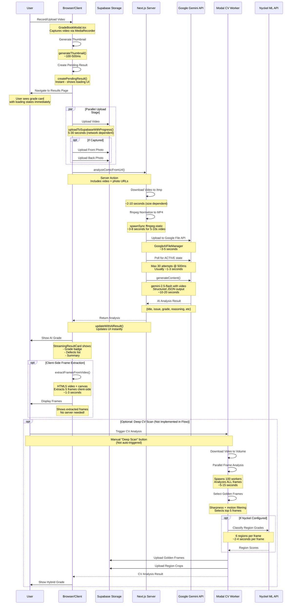

# Video Capture to Grade Pipeline Analysis

## Current Pipeline Architecture

The grading system uses a **multi-stage hybrid approach** combining client-side processing, server actions, and Modal CV analysis:



## Current Performance Metrics

### Total Time to First Grade (AI Only):
**~25-50 seconds** broken down as:

| Stage | Duration | Location | Parallelizable? |
|-------|----------|----------|-----------------|
| **Client-side capture** | 5-10s | Browser | N/A |
| **Video upload to Supabase** | 5-30s | Browser → Supabase | ✅ Yes (parallel with photos) |
| **Download to /tmp** | 2-10s | Next.js server | ❌ Sequential |
| **ffmpeg normalize** | 3-8s | Next.js server | ❌ Sequential |
| **Upload to Google** | 3-5s | Next.js → Gemini | ❌ Sequential |
| **Gemini processing** | 10-20s | Gemini API | ❌ Sequential |
| **Client frame extraction** | 1-3s | Browser | ✅ Yes (parallel, async) |

### Optional Deep CV Scan (Modal):
**~15-40 seconds additional** (if triggered):
- Parallel frame analysis: ~5-15s
- Nyckel classification: ~10-20s (if enabled)
- Upload results: ~2-5s

## Critical Bottlenecks Identified

### 🔴 CRITICAL: Video Processing Pipeline (18-23s)
**Problem**: Sequential video processing is the single largest bottleneck
- Download from Supabase: 2-10s
- ffmpeg normalize: 3-8s  
- Upload to Google: 3-5s
- Poll for ACTIVE: 1-3s
- Gemini analysis: 10-20s

**Current Implementation**: [`app/actions/analyze-from-url.ts`](app/actions/analyze-from-url.ts)

### 🟡 MODERATE: Supabase Upload (5-30s)
**Problem**: Network-dependent, varies widely by connection quality

**Current Implementation**: [`lib/supabase/upload-with-progress.ts`](lib/supabase/upload-with-progress.ts)

### 🟢 OPTIMIZED: Frame Extraction (1-3s)
**Success**: Already optimized with client-side HTML5 extraction

**Current Implementation**: [`lib/frame-extractor.ts`](lib/frame-extractor.ts)

---

## 🚀 Optimization Recommendations

### Priority 1: Direct Browser → Google Upload (HIGHEST IMPACT)
**Potential Savings: 8-18 seconds (40-60% faster)**

**Current Flow:**
```
Browser → Supabase → Next.js Downloads → ffmpeg → Google Upload → Gemini
```

**Optimized Flow:**
```
Browser → Google File API (direct) → Gemini
         ↓
    Supabase (parallel backup for CV later)
```

**Implementation:**
1. Move Google File API upload to client-side
2. Use `GoogleAIFileManager` from browser (requires API key exposure consideration)
3. Upload normalized MP4 directly from browser
4. Keep Supabase upload in parallel for CV/backup

**Trade-offs:**
- ⚠️ Requires exposing Google API key to client (use domain restrictions + rate limits)
- ✅ Eliminates server download + normalize + upload steps
- ✅ Reduces server memory/CPU usage
- ✅ Faster time-to-grade for users

**Files to modify:**
- [`lib/google/file-api.ts`](lib/google/file-api.ts) - Add client-side upload function
- [`components/GradeBookModal.tsx`](components/GradeBookModal.tsx) - Call direct upload
- [`app/actions/analyze-from-url.ts`](app/actions/analyze-from-url.ts) - Accept Google File URI instead of video URL

---

### Priority 2: Client-Side Video Normalization (MEDIUM IMPACT)
**Potential Savings: 3-8 seconds**

**Current**: ffmpeg runs on Next.js server via `spawnSync`

**Optimized**: Use browser MediaRecorder with optimal settings
- Force `video/mp4` output format during recording
- Set codec to H.264 during capture (supported by Gemini)
- Eliminate server-side transcoding entirely

**Implementation:**
```typescript
// In GradeBookModal.tsx - startRecording()
const options: MediaRecorderOptions = {
  mimeType: 'video/mp4;codecs=h264',  // ✅ Gemini-compatible
  videoBitsPerSecond: 2500000,         // ✅ Optimal quality/size
};
```

**Trade-offs:**
- ✅ Eliminates server CPU usage
- ✅ Faster processing
- ⚠️ Relies on browser codec support (fallback needed)
- ⚠️ May produce slightly larger files

**Files to modify:**
- [`components/GradeBookModal.tsx`](components/GradeBookModal.tsx) - Update MediaRecorder options

---

### Priority 3: Parallel Gemini + Frame Extraction (LOW IMPACT)
**Potential Savings: 1-2 seconds**

**Current**: Frame extraction happens after Gemini responds

**Optimized**: Start frame extraction immediately after upload
- Begin client-side extraction as soon as video is in Supabase
- Run in parallel with Gemini analysis
- Frames ready when AI grade completes

**Implementation:**
Already partially implemented in [`components/StreamingResultCard.tsx`](components/StreamingResultCard.tsx), but can be triggered earlier in the flow.

**Files to modify:**
- [`components/GradeBookModal.tsx`](components/GradeBookModal.tsx) - Trigger extraction earlier

---

### Priority 4: Incremental Streaming Results (UX IMPROVEMENT)
**Potential Savings: 0 seconds (but FEELS faster)**

**Current**: User waits for full analysis before seeing anything

**Optimized**: Stream partial results as they arrive
1. Show thumbnail + "Analyzing..." immediately (✅ Already done)
2. Show title/issue as soon as identified (NEW)
3. Show preliminary grade estimate (NEW)
4. Show final grade with confidence (NEW)

**Implementation:**
- Use Gemini streaming API (`generateContentStream()`)
- Update UI progressively as tokens arrive
- Show confidence indicators for partial results

**Trade-offs:**
- ✅ Perceived performance boost (huge UX win)
- ✅ User engagement during wait
- ⚠️ More complex state management
- ⚠️ Requires streaming-aware UI

**Files to modify:**
- [`app/actions/analyze-from-url.ts`](app/actions/analyze-from-url.ts) - Use streaming API
- [`lib/streaming-analysis.ts`](lib/streaming-analysis.ts) - Add progressive update handlers
- [`components/StreamingResultCard.tsx`](components/StreamingResultCard.tsx) - Handle streaming states

---

### Priority 5: Modal CV Optimization (Already Optimized)
**Status**: ✅ Already highly optimized with parallel workers

**Current Performance**: 
- Analyzes ALL frames in 5-15 seconds using 100 parallel Modal workers
- Nyckel classification is external bottleneck (~2-4s per frame)

**Possible Future Optimization**:
- Cache Nyckel results by frame hash
- Skip Nyckel for frames with low sharpness scores

---

## 🎯 Recommended Implementation Order

### Phase 1: Quick Wins (1-2 days)
1. ✅ **Client-side video format optimization** (Priority 2)
   - Update MediaRecorder settings
   - Test cross-browser compatibility
   - Fallback to webm if needed

2. ✅ **Earlier frame extraction** (Priority 3)
   - Trigger extraction right after Supabase upload
   - Show frames while waiting for Gemini

### Phase 2: Major Performance Boost (3-5 days)
3. 🚀 **Direct Browser → Google Upload** (Priority 1)
   - Add client-side Google File API
   - Implement API key security (domain restrictions)
   - Parallel Supabase backup upload
   - Update server action to accept Google URI

### Phase 3: UX Enhancement (2-3 days)
4. ✨ **Streaming Results** (Priority 4)
   - Implement Gemini streaming API
   - Progressive UI updates
   - Confidence indicators

---

## Expected Performance After Optimization

| Stage | Current | Optimized | Savings |
|-------|---------|-----------|---------|
| **Upload** | 5-30s | 5-30s | 0s (network bound) |
| **Server processing** | 8-18s | 0s | **8-18s** ✅ |
| **Gemini analysis** | 10-20s | 10-20s | 0s (API bound) |
| **Frame extraction** | 1-3s | 0s (parallel) | **1-3s** ✅ |
| **Total Time** | **25-50s** | **15-32s** | **~40% faster** 🚀 |

---

## Quality Guarantees

All optimizations maintain grading quality:
- ✅ Same Gemini model (gemini-2.5-flash)
- ✅ Same video quality (H.264 @ 2.5Mbps)
- ✅ Same frame extraction (5 golden frames)
- ✅ Same CV analysis (if triggered)
- ✅ Same Nyckel classifiers (if configured)

**No accuracy trade-offs - only speed improvements!**

---

## Files Requiring Changes

### High Priority (Phase 1-2):
- [`components/GradeBookModal.tsx`](components/GradeBookModal.tsx) - Recording settings, direct upload
- [`lib/google/file-api.ts`](lib/google/file-api.ts) - Client-side upload function
- [`app/actions/analyze-from-url.ts`](app/actions/analyze-from-url.ts) - Accept Google URI
- [`lib/supabase/upload-with-progress.ts`](lib/supabase/upload-with-progress.ts) - Parallel backup

### Medium Priority (Phase 3):
- [`lib/streaming-analysis.ts`](lib/streaming-analysis.ts) - Progressive updates
- [`components/StreamingResultCard.tsx`](components/StreamingResultCard.tsx) - Streaming UI

### Configuration:
- Environment variables for Google API key domain restrictions
- Rate limiting configuration
- CORS policies for Google File API

---

## Risk Mitigation

### Security (Direct Google Upload):
- Use API key with domain restrictions (only allow your domain)
- Implement rate limiting on client
- Monitor usage via Google Cloud Console
- Keep Supabase as backup/audit trail

### Browser Compatibility:
- Test H.264 recording across browsers
- Fallback to webm → server transcode if needed
- Feature detection for MediaRecorder codec support

### Error Handling:
- Retry logic for failed uploads
- Graceful degradation if direct upload fails
- Clear error messages for users
